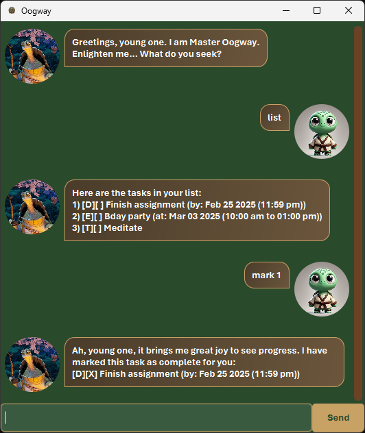

# **Oogway User Guide**



Oogway is a task management chatbot designed to help users keep track of their tasks. 
It offers both a **command-line interface (CLI)** and a **graphical user interface (GUI)**, 
making task management simple and intuitive.

---

## **Features**

### **Adding Tasks**
Oogway supports three types of tasks:

- **Todo** – A simple task with no time constraints.
- **Deadline** – A task with a specific due date and time.
- **Event** – A task that occurs within a specific time range.

#### **Usage:**
```
todo <description>  
deadline <description> /by <yyyy-MM-dd HHmm>  
event <description> /from <yyyy-MM-dd HHmm> /to <HHmm>  
```

#### **Examples:**
```
todo Meditate
deadline Finish assignment /by 2025-02-25 2359
event Bday party /from 2025-03-03 1000 /to 1300
```

---

### **Viewing Tasks**
Users can view tasks in two ways:

#### **List all tasks**
Displays all tasks currently stored.
```
list
```
Example output:
```
Here are the tasks in your list:
1. [D][X] Finish assignment (by: Feb 25 2025 (11:59 pm))
2. [E][ ] Bday party (at: Mar 03 2025 (10:00 am to 1:00 pm))
3. [T][ ] Meditate
```

#### **Find specific tasks**
Search for tasks that contain a keyword.
```
find <keyword>
```
Example:
```
find assignment
```
Expected output:
```
Here are the matching tasks in your list:
1.[D][ ] Finish assignment (by: Feb 25 2025 (11:59 pm))
```

---

### **Modifying Tasks**
Users can **mark, unmark or remove** tasks using the following commands:

- **Mark as completed**
  ```
  mark <index>
  ```
- **Unmark as incomplete**
  ```
  unmark <index>
  ```
- **Delete a task**
  ```
  delete <index>
  ```

Example usage:
```
mark 1
unmark 2
delete 3
```

---

### **General Commands**
- **Help** – Displays a list of available commands.
  ```
  help
  ```
- **Exit the application**
  ```
  bye
  ```
  

### **Command Summary**
Here’s a **concise command summary** for Oogway, formatted for quick reference:

---

# **Oogway Command Summary**

### **General Commands**
| Command | Description |
|---------|-------------|
| `help` | Displays a list of available commands. |
| `bye` | Exits the application. |

### **Viewing Tasks**
| Command | Description |
|---------|-------------|
| `list` | Lists all tasks currently stored. |
| `find <keyword>` | Searches for tasks containing the specified keyword. |

### **Adding Tasks**
| Command | Description |
|---------|-------------|
| `todo <description>` | Adds a to-do task. |
| `deadline <description> /by <yyyy-MM-dd HHmm>` | Adds a task with a deadline. |
| `event <description> /from <yyyy-MM-dd HHmm> /to <HHmm>` | Adds an event with a specific time range. |

### **Modifying Tasks**
| Command | Description |
|---------|-------------|
| `mark <index>` | Marks a task as completed. |
| `unmark <index>` | Marks a task as incomplete. |
| `delete <index>` | Removes a task from the list. |
